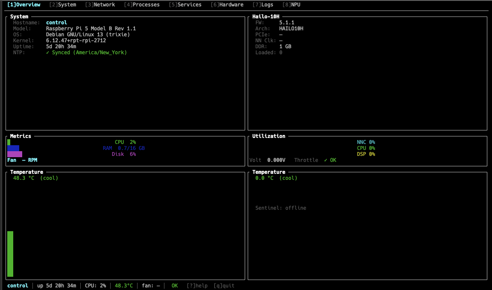

# Pi Cluster Monitor

## Project Goal

Build a Rust-based TUI (Terminal User Interface) that provides quick, at-a-glance visibility into systems running on a local network — initially a Raspberry Pi cluster. The tool should surface network activity, system health, and per-node status without requiring SSH into individual machines or running multiple monitoring commands by hand.

The primary audience is the operator (me), sitting at a terminal, wanting a single pane of glass for the cluster.



## Guiding Principles

- **Fast**: Near real-time data; no waiting for dashboards to load
- **Keyboard-driven**: All navigation via keyboard; minimal mouse interaction
- **Composable**: Start simple, expand with additional data sources and panels
- **Low footprint**: Lightweight agents or agentless where possible (SNMP, SSH, procfs over SSH, etc.)
- **Rust-native**: Prefer Rust crates for performance, correctness, and a single compiled binary

## Architecture Overview

```
┌──────────────────────────────────────────────────────┐
│                  TUI Frontend (ratatui)               │
│  Tabs: Network | Nodes | Connections | Logs | Config  │
└──────────────┬───────────────────────────────────────┘
               │
┌──────────────▼───────────────────────────────────────┐
│              Data Aggregation Layer                   │
│  - Network scanner / discovery                        │
│  - Per-node SSH / agent polling                       │
│  - Local packet capture (rustnet concepts)            │
└──────────────────────────────────────────────────────┘
               │
┌──────────────▼───────────────────────────────────────┐
│              Data Sources                             │
│  - libpcap  (local network traffic)                   │
│  - SSH + procfs/sysfs  (remote node stats)            │
│  - mDNS / ARP / nmap  (network discovery)             │
│  - Optional: lightweight agent on each Pi             │
└──────────────────────────────────────────────────────┘
```

## Scope Phases

### Phase 1 — Foundation
Set up the Rust project with a working ratatui TUI shell, basic network connection view (borrowing from rustnet), and local network interface statistics.

### Phase 2 — Node Discovery
Discover Pi cluster nodes on the local network (mDNS, ARP scan, or a static config). Display a live node list with hostname, IP, and reachability status.

### Phase 3 — Node Health
Poll each node (via SSH or lightweight agent) for CPU, memory, disk, temperature, and load average. Display in a per-node panel.

### Phase 4 — Cluster-Level Views
Aggregate metrics across nodes. Add alerting indicators (CPU > threshold, disk > threshold, node unreachable). Add log tailing from remote nodes.

### Phase 5 — Extensibility
Plugin-like panel system. Support additional data sources (Kubernetes metrics, GPIO state, custom scripts).

## References

### Primary Inspiration

- **rustnet** — Cross-platform network connection monitor with TUI, DPI, process attribution, and bandwidth tracking
  - Repo: https://github.com/domcyrus/rustnet
  - Tech: Rust, ratatui, libpcap, eBPF (Linux)
  - Key concepts to borrow: connection lifecycle view, protocol-aware tracking, per-process attribution, filter/search UX

### Acknowledgements

- [RaspiDash System Monitor](https://github.com/kristoffersingleton/raspi-dash) — Flask-based Raspberry Pi system monitor that served as the original dashboard this project replaces
- [Hailo-10H Web Dashboard](https://github.com/kristoffersingleton/RPI-Hailo-10H-Web-Dashboard) — Web dashboard for the Hailo-10H NPU, also replaced by this project

### TUI Framework

- **ratatui** — Rust TUI library (successor to tui-rs)
  - Docs: https://ratatui.rs
  - Crate: https://crates.io/crates/ratatui
  - Examples: https://github.com/ratatui/ratatui/tree/main/examples

- **crossterm** — Cross-platform terminal manipulation (keyboard events, raw mode)
  - Crate: https://crates.io/crates/crossterm

### Networking

- **pcap** (Rust bindings to libpcap) — Packet capture
  - Crate: https://crates.io/crates/pcap

- **netscan** or **ipnetwork** — Network scanning and CIDR utilities

- **mdns-sd** — mDNS service discovery for finding Pi nodes
  - Crate: https://crates.io/crates/mdns-sd

### SSH / Remote Polling

- **russh** — Pure-Rust SSH client/server
  - Crate: https://crates.io/crates/russh

- **ssh2** — libssh2 bindings for Rust
  - Crate: https://crates.io/crates/ssh2

### System Metrics

- **sysinfo** — Cross-platform system info (CPU, RAM, disk, temperature)
  - Crate: https://crates.io/crates/sysinfo
  - Useful locally; remote nodes require SSH or agent

### Configuration

- **serde** + **toml** — Config file parsing
  - Crates: https://crates.io/crates/serde, https://crates.io/crates/toml

### Related Tools for Reference

- **btop** — Beautiful system monitor, good UX reference
  - Repo: https://github.com/aristocratos/btop

- **bpytop** / **bashtop** — Python/Bash predecessors to btop

- **netdata** — Real-time performance monitoring with agent model
  - Site: https://www.netdata.cloud

- **lazydocker** — Docker TUI; good example of multi-panel TUI design
  - Repo: https://github.com/jesseduffield/lazydocker

- **k9s** — Kubernetes TUI; excellent example of resource-list + detail panel layout
  - Repo: https://github.com/derailed/k9s
